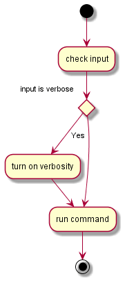

I virkelig store prosjekter er det ofte aktuelt å skille grensesnittet og
funksjonaliteten fra hverandre. Det er fordi det ikke er gitt at et system
kun skal ha ett grensesnitt (for eksempel både web, mobil, applikasjon), og
at grensesnittet skal være utskiftbart uten å endre selve systemet i bunn. Vi
ønsker med andre ord at det er en svakest mulig binding mellom
grensesnittet og selve funksjonaliteten.

Til prosjekter av den størrelsen som vi ser på i denne boka, er
det imidlertid bedre å planlegge grensesnitt og funksjonalitet
sammen. Det er som oftest lite funksjonalitet i systemet
som ikke er direkte knyttet til grensesnittet når
applikasjonene er små.

Til å planlegge grensesnittet og funksjonaliteten er
det nødvendig med noen konkrete teknikker. Vi
skal i denne boka beskrive følgende teknikker:

* Flytdiagram
* Psedokode
* Handlingsdiagram
* Brukergrensesnittskisser (wireframes)

Det er ikke sagt at alle typer prosjekter trenger
å benytte alle disse teknikkene, og det kan også
være at din arbeidsmetode for planlegging
krever helt andre teknikker. Disse teknikkene
kan imidlertid være et utgangspunkt for
planleggingen.

## Flytdiagram
Et flytdiagram forteller noe om den såkalte kontrollflyten i programmet.
Dette innebærer hvilke valg som systemet skal ta, hvilken input systemet
skal hente, hvilken output systemet skal gi, samt hvilke prosesseringer/
beregninger som skal gjøres underveis.

Man tegner ofte et flytdiagram for hver operasjon som skal gjøres i
systemet, da med ett eller flere start- og avslutningspunkter på
prosessen. Flytdiagram kan både benyttes for å illustrere den
overordnede flyten i applikasjonen og detaljene i en enkelt
del. Ofte kan det være lurt å lage flytdiagrammer for flere
nivåer.

Til bruk i vår sammenheng har vi forenklet den
formelle standarden for flytdiagrammer en god
del og introduserer kun tre ulike elementer.

Disse er:
* Ellipser: Start- eller sluttpunkter for
sekvensen som kontrollflyten omhandler.
* Diamanter: Valg som systemet skal gjøre.
Selve testen står inne i diamanten, og vi setter
på etiketter på de ulike utfallene.
* Rektangler: Prosessering som systemet skal
gjøre. Dette tilsvarer én eller flere instruksjoner
i programkoden. Teksten i rektangelet gir en
kort oppsummering av hva prosesseringen gjør.



## Pseudokode

En god teknikk for å planlegge de ulike delene av en applikasjon er å
skrive pseudokode. Enkelt forklart er pseudokode tekst som er skrevet slik
at den skal være enkel å oversette til programkode. Derfor er teksten ofte
strukturert som nummererte punkter for å imitere maskinens utførelse av
kode linje for linje. I tillegg bruker man flittig ord som "så lenge", "for alle
elementer i" og "hvis", noe som direkte kan oversettes til
programkodeelementer som while, for og if.

Pseudokode for å finne og skrive ut minste element i en array kan se slik ut:

    1.      Husk på første element i arrayen som det minste tallet
    2.      Gå gjennom arrayen element for element
    2.1.    Hvis elementet er mindre enn tallet vi husker på som minst
    2.1.1.      Husk på dette elementet som det minste tallet
    3.      Skriv ut det tallet vi husker på som det minste

Skulle vi skrevet pseudokode for å finne ut om en array inneholder et tall
eller ikke, og så skrive ut en melding basert på dette, kan det se slik ut:

    1.      Gå ut fra at elementet ikke finnes i arrayen
    2.      Gå gjennom arrayen element for element
    2.1.    Dersom elementer er tallet vi leter etter
    2.1.1.      Husk på at tallet finnes i lista
    2.1.2.      Avslutt gjennomgangen
    3.      Hvis tallet finnes i lista
    3.1.        Skriv ut melding om at tallet finnes
    4.      Hvis tallet ikke finnes i lista
    4.1.        Skriv ut melding om at tallet ikke finnes i lista


## Handlingsdiagram

Dokumenteringsstandarden UML har en type diagram som kalles user
case, og som gir en grafisk oversikt over aktører og handlinger i et system.
Dette er imidlertid en veldig formell standard som vi vil forenkle mye og
kalles handlingsdiagram.
I sin enkle form forteller handlingsdiagrammet noe om hvilke aktører som
finnes i systemet, og hvilke handlinger de kan utføre. Aktørene tegnes som
strekfigurer, mens handlingene som sirkler med navn på handlingene i.
Merk deg at en aktør ikke nødvendigvis må være en person, men også kan
være andre systemer som utfører handlinger i vårt system.
Til hver operasjon må vi også forklare kort hva operasjonen går ut på, samt
hva som er normal flyt, og hva som er unntak i handlingen. Den normale
flyten er en nummerert liste, mens unntakene henviser til punkter i den
normale flyten.
Et eksempel på beskrivelse av handlingen Login kan være som følger:

**Login**  
Brukeren logger inn i systemet med sitt tildelte brukernavn og passord, og
får etter det tilgang til lukkede ressurser.

**Normal flyt:**
1. Brukeren taster inn brukernavn i tekstboksen for dette
2. Brukeren taster inn passord i tekstboksen for dette
3. Brukeren klikker på Login-knappen
4. Systemet kontroller brukernavn og passord opp mot sin liste av gyldige brukernavn/passord
5. Systemet setter status til innlogget

**Unntak:**  
4. Brukernavnet og passordet stemmer ikke overens med gyldige
kombinasjoner av brukernavn og passord. Handlingen avsluttes, og en
feilmelding vises for brukeren

## Wireframes

En viktig del av planleggingen er å finne ut hvordan brukergrensesnittet
bør være og fungere. Brukergrensesnittet er brukerens opplevelse av
applikasjonen og bør være mest mulig selvforklarende. For å planlegge
slike brukergrensesnitt kan vi benytte en teknikk som kalles
brukergrensesnittskisser (engelsk wireframes).

Merk deg at når vi skal planlegge brukergrensesnittet ved
hjelp av brukergrensesnittskisser, er det ikke designet,
men oppbygningen og funksjonaliteten vi planlegger.
Hvilke farger som skal benyttes, og om en knapp skal ha
avrundede hjørner, er typiske ting som ikke er relevante
på dette tidspunktet, så lenge de ikke er elementer som
påvirker selve bruken av applikasjonen.

For å oppnå målet om å fokusere på selve
brukergrensesnittets funksjoner er det viktig at vi tegner
ganske grove skisser. Ved å bruke enkle strektegninger
sikrer vi at det blir en plan for funksjonaliteten og ikke
en eksakt mal for designet av applikasjonen.

Det som er fokuset i slike skisser, er å planlegge hvilke typer
kontrollere (aktive elementer) applikasjonen skal inneholde,
samt hvordan de skal plasseres for et mest mulig intuitivt og
effektivt grensesnitt. Dette er altså komponenter slik som knapper,
listebokser, nedtrekkslister, radioknapper og avkrysningsbokser.

Bilder indikeres kun ved hjelp av en boks som viser
plasseringen, og tekst er ofte også kun en plasseringsboks
eller såkalt dummytekst.

Et enkelt eksempel på en brukergrensesnittskisse kan være følgende:

```
    /Skriv inn personalia/
                                 :-----:
    Fornavn    |______|          :Bilde:       | Enkelt rom |\/|
    Etternavn  |______|          :-----:       | Dobbelt    |
                                               | Familie    |

    <[Lagre]> <|Avbryt|>
```

I tillegg til selve skissen er det viktig også å ha med noe forklarende
tekst om hvilke underliggende funksjoner de ulike elementene i
grensesnittet skal initiere, samt funksjonalitet i selve brukergrensesnittet.

Her må vi derfor beskrive hva som skal skje når vi trykker på de ulike
knappene, hvordan nedtrekkslister skal fylles med elementer, endringer i
brukergrensesnittet når visse elementer blir valgt, osv.

Typisk kan slike beskrivelser se slik ut:  
*	Dersom brukeren krysser av for "anonym", skal feltene for navn og e-post disables (gråes ut). Disse skal enables når brukeren fjerner krysset for "anonym".
*	Når brukeren trykker på knappen oppdater, skal totalprisen for varen beregnes på nytt og vises i tekstboksen for totalpris.